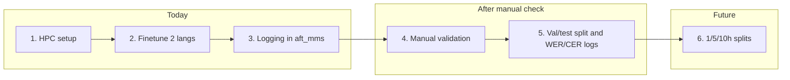

# Low-resource finetuning – today’s tasks and follow-ups

## Scope

- **Implement now (Steps 1–3):** HPC setup fixes, 2-language finetune run, logging in `aft_mms.py`.
- **After manual validation (Steps 4–5):** Discard current test set; split validation into 45-min test + new validation; add WER/CER on train/val/test and richer logs.
- **Later (Step 6):** 1/5/10-hour training splits – out of scope until 1–3 are done.

---

## 1. HPC setup scripts – platform compatibility

**Goal:** Make [hyak_setup.sh](scripts/hyak_setup.sh) and SLURM scripts correct for the HPC cluster and for your case (no lab, project dir specific to you).

### 1.1 Variables to fix

| Variable        | Current                               | Correct for “no lab”                                                                                                    |
| --------------- | ------------------------------------- | ----------------------------------------------------------------------------------------------------------------------- |
| **ACCOUNT**     | `YOUR_ACCOUNT`                        | Whatever your cluster allocation shows (e.g. `myaccount` for free student). Must be set for `#SBATCH --account`.                          |
| **PROJECT_DIR** | `/gscratch/$ACCOUNT/low-resource-asr` | **Without lab:** `/gscratch/scrubbed/$USER/low-resource-asr`. Scrubbed is available to all users; 21-day purge applies. |

**Actions:**

- In [hyak_setup.sh](scripts/hyak_setup.sh): keep `ACCOUNT` as a user-editable placeholder; set `PROJECT_DIR` to `/gscratch/scrubbed/$USER/low-resource-asr` when no lab (or make it conditional / clearly documented).
- In [hyak_train_single.slurm](scripts/hyak_train_single.slurm) and [hyak_train_all.slurm](scripts/hyak_train_all.slurm): replace hardcoded `/gscratch/YOUR_ACCOUNT/low-resource-asr` with a single placeholder (e.g. `PROJECT_DIR`) so both account and path are consistent. Use `PROJECT_DIR=/gscratch/scrubbed/$USER/low-resource-asr` for your case.
- Ensure `CONDA_DIR` stays under scratch if you keep conda: e.g. `/gscratch/scrubbed/$USER/miniconda3` (already correct in setup script).

### 1.2 uv vs Miniconda

**Why the script used Miniconda:** Common on HPC, no extra install, and the [hyak-hpc agent](.cursor/agents/hyak-hpc.md) suggests conda in scratch.

**Why use uv on HPC:**

- Matches your local workflow and [pyproject.toml](pyproject.toml) + lockfile.
- Reproducible installs; no env drift between local and HPC.
- Faster dependency installs and smaller envs.

**Recommendation:** Prefer **uv on HPC** for this project. In setup:

1. Install uv once (e.g. in scratch): `curl -LsSf https://astral.sh/uv/install.sh | sh` (or install to `$HOME/.cargo/bin` or `/gscratch/scrubbed/$USER/.local/bin` and add to `PATH`).
2. In project dir: `uv sync` (or `uv sync --no-dev` for smaller env).
3. Run training with `uv run python -m src.training.aft_mms ...` (as in your current SLURM).

**If you keep Miniconda:** Use it only for HPC; ensure `PROJECT_DIR` and all paths in SLURM point to the same place and that conda env is created under `/gscratch/scrubbed/$USER/` so you don’t fill home.

**Concrete plan:** Update [hyak_setup.sh](scripts/hyak_setup.sh) to an **uv-first** path: create project dir under `/gscratch/scrubbed/$USER/low-resource-asr`, install uv, run `uv sync`, and optionally keep a short “conda alternative” comment. Then in SLURM scripts use only uv: `cd $PROJECT_DIR`, `uv run python -m src.training.aft_mms ...`, and remove or comment the conda block.

---

## 2. Finetune MMS for two languages (train + validation only)

**Goal:** Run [aft_mms.py](src/training/aft_mms.py) for two languages on HPC using [hyak_train_single.slurm](scripts/hyak_train_single.slurm). Training on train set only; final metric on **validation set only** (no test).

### 2.1 Current behavior (no changes required for “no test”)

- [load_and_preprocess_data](src/training/aft_mms.py) reads `ss-corpus-{lang}.tsv` and uses only `split == "train"` and `split == "dev"`. No test TSV or test set is loaded.
- Evaluation is on `val` only; `eval_results.json` is written under the model output dir.

So for “finetune on train, WER on validation only,” the script is already correct.

### 2.2 SLURM script checks

- **Account/path:** Use the same `PROJECT_DIR` (and `ACCOUNT` for `#SBATCH --account`) as in section 1. Replace all `YOUR_ACCOUNT` and hardcoded project path with a single `PROJECT_DIR` (and ensure `ACCOUNT` is set for SBATCH).
- **Environment:** After section 1, use uv only: `cd $PROJECT_DIR`, `uv run python -m src.training.aft_mms "$LANG" ...`.
- **Two languages:** Run twice, e.g. `sbatch scripts/hyak_train_single.slurm aln` and `sbatch scripts/hyak_train_single.slurm sco` (or any two from [LANGUAGES](src/data/download.py)).

### 2.3 Data on HPC

- Ensure `data/mozilla_speech_data/<lang>/ss-corpus-<lang>.tsv` and `shared_train_validation_audios/` are present under `$PROJECT_DIR` (upload or sync from local).

---

## 3. Logging in aft_mms – performance and stats to a log file

**Goal:** Besides `eval_results.json`, write a **datetime-named log file** that records run metadata and validation performance for future reference.

### 3.1 What to log

- **Identifiers:** model name (e.g. `facebook/mms-1b-all`), language code, run datetime.
- **Metrics:** validation WER (and later CER when you add it).
- **Other stats:** e.g. num train/val samples, num epochs, batch size, learning rate, best checkpoint step/epoch if available from trainer state.
- **Location:** e.g. `results/training_logs/` or under `config.results_dir` with a subdir like `training_logs/`.

### 3.2 Implementation outline

- At start of `main()` in [aft_mms.py](src/training/aft_mms.py): create a log file path like `results_dir / "training_logs" / f"mms_aft_{lang}_{datetime.now():%Y%m%d_%H%M%S}.log"` (or `.json` for machine-readable).
- Write a header line/section with: timestamp, lang, model name, output_dir.
- After `trainer.train()` and `trainer.evaluate()`: append to the same file (or write once at the end) final validation WER, and any other stats you already have (e.g. from `eval_results`, `trainer.state`).
- Keep existing `eval_results.json` in the model output dir unchanged so you still have full Trainer metrics there.

This gives you a single, human- and script-friendly log per run, named by datetime, without touching test set or data splits.

---

## 4. After step 2–3: manual validation

You compare the logged validation WER (and any other metrics) to your expectations/ground truth. No code changes.

---

## 5. Later: validation/test split and WER/CER on all splits

**Only after step 4.**

### 5.1 Data split change

- **Discard:** Current test set (no longer use `test-{lang}.tsv` / `shared_test_audios` for evaluation).
- **New scheme:** For each language, take current **validation** (rows with `split == "dev"` in `ss-corpus-{lang}.tsv`). Split by duration:
  - **Test:** first (or a deterministic) 45 minutes of audio.
  - **New validation:** the remainder (V − 45 min).

Implementation options:

- **Option A:** New script that reads `ss-corpus-{lang}.tsv`, filters `split == "dev"`, sorts by a stable key (e.g. `audio_file`), and assigns rows to test vs validation by cumulative `duration_ms` until 45 min (2_700_000 ms) is reached; write updated TSV or separate `dev-{lang}.tsv` / `test-{lang}.tsv` that the loader can use.
- **Option B:** Same logic inside the data loader: when building “validation” and “test” for training/eval, derive them from the current dev set with a 45-min split. Option A is clearer and easier to audit.

Training data (train split) remains unchanged.

### 5.2 Metrics and logging

- In [aft_mms.py](src/training/aft_mms.py): add CER (e.g. `evaluate.load("cer")`) alongside WER in `create_compute_metrics_fn` and in any explicit eval loops.
- Compute and log **WER and CER** on **train** (optional), **validation**, and **test** (post-training evaluation on the new test set).
- Extend the datetime-named log file to include: hyperparameters (epochs, batch size, lr, etc.), WER/CER per split, and any other training details. Keep filename datetime-based.

### 5.3 Script updates

- [hyak_train_single.slurm](scripts/hyak_train_single.slurm) / [hyak_train_all.slurm](scripts/hyak_train_all.slurm): after data split and loader changes, ensure they still point to `$PROJECT_DIR` and invoke `aft_mms` with the same CLI; no structural change beyond path/account from section 1.

---

## 6. Later: 1 / 5 / 10 hour training splits

Deferred until steps 1–3 are done. Will require:

- Filtering or subsampling the train set by cumulative duration (1h, 5h, 10h) per language.
- Either separate jobs or a `--max-train-hours` (or similar) flag in [aft_mms.py](src/training/aft_mms.py) and corresponding SLURM parameterization.

Not in scope for “today’s” implementation.

---

## Dependency overview

---

## File touch map

| Step      | Files to change                                                                                                                                                                  |
| --------- | -------------------------------------------------------------------------------------------------------------------------------------------------------------------------------- |
| 1         | [scripts/hyak_setup.sh](scripts/hyak_setup.sh), [scripts/hyak_train_single.slurm](scripts/hyak_train_single.slurm), [scripts/hyak_train_all.slurm](scripts/hyak_train_all.slurm) |
| 2         | No code changes; run SLURM after 1 and data upload                                                                                                                               |
| 3         | [src/training/aft_mms.py](src/training/aft_mms.py), possibly [src/config.py](src/config.py) if you add a results subdir                                                          |
| 5 (later) | New split script or data loader in `src/data/`, [src/training/aft_mms.py](src/training/aft_mms.py) (load new splits, add CER, extend log)                                        |

---

## Summary

1. **HPC:** Use `/gscratch/scrubbed/$USER/low-resource-asr` and `ACCOUNT` from cluster allocation; make setup uv-first and SLURM scripts use a single `PROJECT_DIR` + uv.
2. **Two-language run:** Use existing train/dev-only logic; fix only account/path in SLURM and run two `sbatch` jobs.
3. **Logging:** Add a datetime-named log file under `results/training_logs/` (or similar) with model name, language, validation WER, and basic run stats.
4. **Manual check:** You compare logged metrics to ground truth.
5. **Later:** 45-min test from current validation, rest as new validation; add CER and log WER/CER for train/val/test with datetime log and hyperparameters.
6. **Much later:** 1/5/10-hour training splits.

